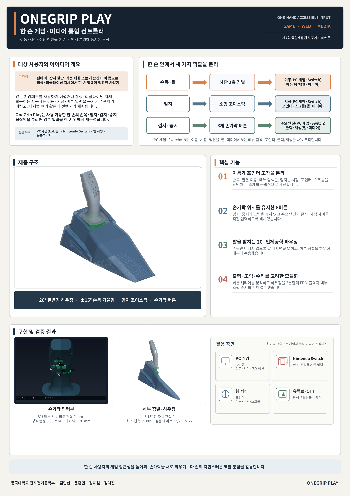

# OneGrip Play

한 손으로 PC 게임, Nintendo Switch, 웹 서핑과 미디어 조작을 할 수 있도록 만든 보조 입력기입니다. 손목·팔, 엄지, 검지·중지에 서로 다른 역할을 배분해 한 손 안에서 이동, 시점 조작, 버튼 입력을 함께 수행하는 것을 목표로 합니다.

> 현재 상태: 주요 기구부의 CAD와 자동 형상 검증, 전자부품 서비스 카세트, 전시용 A1 포스터까지 제작했습니다. 최종 실물 조립, 펌웨어 통합, 반복 내구시험과 대상 사용자 평가는 아직 진행해야 합니다.

<p align="center">
  
</p>

## 1. 개발 배경

양손 게임패드나 키보드·마우스는 이동, 시점, 액션 입력을 양손에 나눠 배치합니다. 다음과 같은 사용자는 손가락과 엄지를 움직일 수 있어도 이 입력들을 동시에 수행하기 어렵습니다.

- 편마비 또는 한쪽 상지의 기능 제한이 있는 사용자
- 한쪽 상지 절단으로 한 손 입력이 필요한 사용자
- 하반신 마비 등으로 침상이나 리클라이닝 자세에서 활동하는 사용자
- 팔을 넓게 움직이거나 양손 기기를 안정적으로 지지하기 어려운 사용자

OneGrip Play는 재활 효과를 주장하는 의료기기가 아니라, 게임과 디지털 여가에 접근할 수 있도록 돕는 보조 입력기 시제품입니다.

## 2. 현재 채택한 입력 구조

| 사용하는 부위 | 입력 장치 | PC 게임·Switch | 웹·미디어 |
|---|---|---|---|
| 손목·팔 | 하단 2축 짐벌 | 캐릭터 이동 | 메뉴 탐색 |
| 엄지 | 소형 조이스틱 | 시점 조작 | 포인터 이동·스크롤 |
| 검지·중지 | 8개 손가락 버튼 | 주요 액션 | 클릭·재생 제어 |

핵심은 입력 수를 무작정 늘리는 것이 아니라, 사용자가 이미 구분하기 쉬운 세 동작에 기능을 나누는 것입니다. 현재 통합안은 초기의 전체 QWERTY·트랙볼 구조가 아니라 **게임과 미디어에 필요한 핵심 입력을 우선한 구조**입니다.

## 3. 설계가 바뀐 과정

### 3.1 버티컬 키보드·트랙볼 탐색

처음에는 버티컬 마우스형 그립에 전체 문자 키와 엄지 트랙볼을 결합하는 방향을 검토했습니다. Half-QWERTY, 전체 물리 자판, U자형 키타워, 손가락별 3방향 스위치와 엄지 보조키 등 여러 배치를 비교했습니다.

그러나 전체 문자를 작은 그립에 넣으면 다음 문제가 생겼습니다.

- 키가 작아지고 인접 입력 가능성이 커짐
- 새로운 배열과 레이어 전환을 학습해야 함
- 손가락 독립성이 낮은 사용자에게 조작 부담이 커짐
- 멘토링에서 “적응하기 어려워 보인다”는 피드백을 받음

### 3.2 조종간형 뱅크 전환 탐색

본체를 좌우로 기울여 Bank A/B를 전환하고, 각 손가락에 좌·중앙·우 입력을 배치하는 조종간형 구조도 검토했습니다. 손가락 길이 차이, 지문 접촉 위치, 손바닥 지지, 중수골 스트랩, 엄지 도달 범위를 렌더로 반복 수정했습니다.

이 구조는 많은 문자를 넣을 수 있었지만 학습량과 기구 복잡도가 다시 증가했습니다. 이후 제품 목적을 문자 입력기에서 게임·미디어 보조 컨트롤러로 좁혔습니다.

### 3.3 OneGrip Play로 범위 축소

현재는 다음 원칙을 적용합니다.

1. 전체 키보드를 넣지 않는다.
2. PC 게임과 Nintendo Switch의 이동·시점·주요 액션을 우선한다.
3. 웹 서핑과 유튜브·OTT에 필요한 포인터·스크롤·클릭·재생 기능을 함께 제공한다.
4. 별도의 복잡한 문자 Bank 대신 기능 프로필로 입력을 매핑한다.
5. 커스텀 PCB 없이 완제품 개발보드와 직접 배선으로 시제품을 제작한다.

## 4. 인체공학 설계 기준

- 팔받침 각도: **20°**
- 손목만으로 기기를 지탱하지 않도록 전완 지지면을 넓게 구성
- 손을 퍼티에 쥔 듯한 곡면을 기준으로 손바닥과 손가락 접촉면 형성
- 손가락 길이 차이를 반영해 검지·중지 입력 위치를 다르게 배치
- 버튼을 누르기 위해 그립에서 손가락을 크게 떼지 않도록 구성
- 입력부를 교체 가능한 카세트로 분리해 손 크기와 스위치 공차를 조정 가능하게 설계

이 항목들은 CAD 설계 기준입니다. “인체공학적으로 최적”하다고 확정하려면 대상 사용자의 실제 손 자세, 압력 분포, 도달률과 피로도 시험이 필요합니다.

## 5. 기구 설계

### 5.1 검지·중지 8버튼 카세트

현재 통합 모듈은 검지 4키와 중지 4키로 구성됩니다.

- 기존 손가락 곡률과 버튼 중심을 유지
- 버튼 캡이 손가락 표면의 법선 방향으로 움직이도록 가이드 적용
- 검지와 중지를 각각 메인 3키와 측면 1키로 분리
- 깊은 스위치 홀더 대신 얕은 receiver와 내부 carrier 사용
- ITS-1105 실측값을 기준으로 스위치 포켓에 측면 여유 확보
- 공통 TPU rear pad로 스위치 후면을 지지
- FDM 출력 전 공차 쿠폰으로 스위치와 캡 끼워맞춤을 먼저 확인

자세한 제작 순서는 [`cad/onegrip-index-middle-cassette-v2/README.md`](cad/onegrip-index-middle-cassette-v2/README.md)에 정리했습니다.

### 5.2 3방향 손가락 모듈 연구안

별도 연구 브랜치에서는 검지·중지·약지·소지 각각에 LEFT/CENTER/RIGHT 독립 입력을 배치했습니다. 하나의 로커를 세 방향으로 쓰지 않고, 중앙 직선 플런저와 좌우 독립 회전 패들을 분리한 구조입니다.

최신 자동 검증 결과는 다음과 같습니다.

| 검증 항목 | 결과 |
|---|---:|
| 모듈 내부 최대 교차 부피 | 0.2787 mm³ |
| 인접 손가락 모듈 간 교차 부피 | 0.0 mm³ |
| B-rep 유효성 | 전 부품 통과 |
| hard stop 검증 | 4손가락 통과 |
| 종합 판정 | `overall_pass: true` |

이 결과는 CAD 형상 검증이며, 실제 입력 정확도나 피로도를 증명하지 않습니다. 자료는 [`cad/finger-input-v2-ergonomic/`](cad/finger-input-v2-ergonomic/)에 있습니다.

### 5.3 하부 2축 짐벌

하부 짐벌은 손잡이 전체를 움직여 이동 또는 메뉴 탐색 입력을 만드는 구조입니다.

- 20° 기울어진 원본 하우징 좌표계를 월드 좌표에 맞춰 조립
- 고정부와 가동부를 Blender 부모 계층으로 분리
- Ring과 Hub를 서로 다른 축의 피벗으로 구성
- 현재 Full Module V3 기준 기구 이동 범위는 축별 ±10°
- 고정 베이스 바닥에서 `HAND_REF`까지 85.153 mm
- 경사 데크에서 `HAND_REF`까지 법선 방향 55.879 mm
- 피벗은 착좌면보다 18.5 mm 아래에 위치

38개 출력 STL은 모두 closed manifold로 확인했습니다. ±10° 조합 자세에서 계산한 표면점 최소거리는 모두 양수였지만, 이는 정확한 솔리드 Boolean 보증이 아니라 샘플링 기반 근사입니다. 베어링 저널, 나사 물림, 스프링, Hall 센서와 중력 보상은 추가 검증이 필요합니다.

전체 조립 자료는 [`cad/onegrip-full-module-v3/`](cad/onegrip-full-module-v3/)에서 확인할 수 있습니다.

## 6. 전자부품 서비스 카세트

커스텀 PCB는 사용하지 않습니다. RP2040-Zero와 전원보드를 같은 높이에 나란히 배치하고, 사람이 직접 조립·수리할 수 있는 단층 카세트를 만들었습니다.

| 항목 | 설계값 |
|---|---:|
| 카세트 조립 외형 | 36 × 45 × 14 mm |
| RP2040-Zero 실측 | 17.92 × 23.15 mm |
| RP2040 포켓 | 18.42 × 24.35 mm |
| 전원보드 | 15.35 × 23.24 mm |
| 보드 배치 | 단층·나란히 배치 |
| 뚜껑 체결 | M3 수직 나사 4개 |

주요 수정 내용은 다음과 같습니다.

- 기존 매립 트레이와 2층 적층안은 조립·정비가 어려워 폐기
- RP2040 길이 방향 여유를 끝당 0.60 mm로 확대
- 전원보드 외부 단자 개구 삭제
- 두 보드를 카세트 위에서 독립적으로 넣고 뺄 수 있도록 설계
- 카세트 본체는 고정 `Base` 전면에 연결하고 뚜껑은 별도 부품으로 유지
- 원본 Base의 불필요한 후면 돌출부와 중앙 벽을 제거하고 데크 상면 단차를 수정
- 스프링 고정 보스 4개와 움직이는 귀 4개를 보존

카세트와 뚜껑은 별도 솔리드이며 같은 출력판에서 함께 출력할 수 있습니다. 카세트 부착부는 스톡 짐벌의 축별·대각선 ±20° 검사에서 가동부와 계산상 교차 부피 0 mm³를 기록했습니다.

남은 STOP 조건은 전원보드 하부 부품의 실제 XY 위치, 최고 부품 높이, 실제 USB-C 플러그 외형과 케이블 굽힘 반경입니다. 자세한 내용은 [`cad/electronics_service_cassette/README.md`](cad/electronics_service_cassette/README.md)를 참고하십시오.

## 7. 전자·펌웨어 방향

- 메인 제어기: RP2040-Zero
- 제작 방식: 커스텀 PCB 없이 개발보드·모듈·직접 배선 사용
- 손가락 입력: 디지털 스위치 직접 배선 또는 입력 확장 모듈 검토
- 하부 짐벌과 엄지 조이스틱: 아날로그 축 입력
- 대상 환경: Windows PC, Nintendo Switch, 웹·미디어 제어

현재 저장소에는 기구 설계와 전자부품 배치 검토가 중심적으로 들어 있습니다. 최종 HID 펌웨어, 플랫폼별 프로필, 연결 안정성 및 장시간 시험은 완료 상태로 표시하지 않습니다.

## 8. 검증 현황

| 항목 | 현재 상태 | 남은 작업 |
|---|---|---|
| 대상 사용자·사용 시나리오 | 정의 완료 | 장애인 멘토 대상 추가 인터뷰와 과제 관찰 |
| 20° 팔받침 외형 | CAD 반영 | 손 크기별 파지·압력 시험 |
| 검지·중지 8버튼 | CAD·공차 설계 | 공차 쿠폰, 스위치 조립, 연타·오입력 시험 |
| 3방향 손가락 연구안 | 자동 형상 검증 통과 | 실제 복귀력·피로·정확도 시험 |
| 하부 2축 짐벌 | 조립·좌표계·가동 시각화 | 베어링/나사/스프링/센서 실물 검증 |
| 서비스 카세트 | CAD·간섭 검증 및 실물 피드백 반영 | 전원보드 부품 높이와 케이블 굽힘 반경 확정 |
| PC·Switch 입력 | 요구사항 정의 | 펌웨어·프로필·실기 연결 시험 |
| 웹·미디어 제어 | 기능 매핑 정의 | 포인터·스크롤·재생 시나리오 시험 |
| 전시 자료 | A1 포스터 제작 완료 | 최종 실물 사진과 사용자 시험 결과 반영 |

## 9. 저장소 구조

```text
.
├─ cad/
│  ├─ onegrip-full-module-v3/          전체 조립과 하부 짐벌
│  ├─ onegrip-index-middle-cassette-v2/ 검지·중지 8버튼 카세트
│  ├─ finger-input-v2-ergonomic/       4손가락 3방향 연구안
│  ├─ electronics_service_cassette/    RP2040·전원보드 카세트
│  ├─ stock-cartridge-option-c/        스톡 짐벌 카트리지 검토
│  └─ source_snapshot/                  팀원·Claude 최소 재현 원본
├─ analysis/                            부품 배치와 간섭 탐색 스크립트·결과
├─ docs/                                기구 분석, BOM, 시험 계획, 보고서
├─ references/                          Lalboard 재현용 잠금 정보와 가져오기 스크립트
├─ renders/                             초기 아이디어와 설계 탐색 렌더
├─ 전시포스터/                         A1 PPTX·PDF·PNG와 생성 스크립트
├─ 팀원공유용/                          팀 공유 압축본
├─ 계획및부품안.md                     초기 현실 구현안
├─ 완전구현_설계및부품안.md            전체 구현 검토안
└─ RP2040_전원보드_배치검토.md          전자부품 배치 결정 과정
```

`renders/`에는 채택하지 않은 트랙볼·키타워·뱅크 전환안도 포함되어 있습니다. 현재 채택안을 확인할 때는 `cad/onegrip-full-module-v3/`, `cad/onegrip-index-middle-cassette-v2/`, `cad/electronics_service_cassette/`를 우선하십시오.

### 작업본 계보

현재 통합본은 한 작업자가 처음부터 다시 만든 형상이 아닙니다.

| 출처 | 반영된 내용 | 현재 위치 |
|---|---|---|
| 팀원 최신 OneGrip 작업본 | 우측 상부 쉘, 기존 엄지 버튼·조이스틱, 기준 조립 좌표 | `cad/source_snapshot/team_claude_latest/` |
| Claude Code 체크포인트 | 검지·중지·엄지 구조 분석, 20° 하부 매립 짐벌과 검증 데이터 | 최소 원본 스냅숏과 `cad/onegrip-full-module-v3/` |
| 현재 통합·수정 작업 | 검지·중지 8버튼 V2, 짐벌 고정/가동 보정, 서비스 카세트, 포스터 | `cad/`, `analysis/`, `전시포스터/` |

GitHub에서 전체 모듈을 다시 만들 때 Desktop의 원래 작업 폴더가 없어도 되도록,
빌드에 실제로 필요한 18개 원본 파일을 저장소 내부에 포함했습니다. 자세한 범위와
해시는 [`cad/source_snapshot/team_claude_latest/README.md`](cad/source_snapshot/team_claude_latest/README.md)에 기록했습니다.

## 10. 주요 산출물

- 전체 모듈 패키지: [`OneGrip_Full_Module_RH_V3_EMBEDDED_GIMBAL.zip`](OneGrip_Full_Module_RH_V3_EMBEDDED_GIMBAL.zip)
- 검지·중지 카세트 패키지: [`OneGrip_IndexMiddle_Cassette_V2.zip`](OneGrip_IndexMiddle_Cassette_V2.zip)
- A1 전시 포스터: [`전시포스터/OneGrip_Play_A1_전시포스터.pdf`](전시포스터/OneGrip_Play_A1_전시포스터.pdf)
- 인쇄용 포스터 PNG: [`전시포스터/OneGrip_Play_A1_전시포스터_인쇄용.png`](전시포스터/OneGrip_Play_A1_전시포스터_인쇄용.png)
- 전자부품 배치 검토: [`RP2040_전원보드_배치검토.md`](RP2040_전원보드_배치검토.md)

대용량 ZIP은 소스와 중복되므로 Git 저장소에 계속 누적하기보다 GitHub Releases에 배포하는 편이 적합합니다.

## 11. 다음 단계

1. ITS-1105 공차 쿠폰과 검지 버튼 1세트를 먼저 출력합니다.
2. RP2040 길이 공차 쿠폰에서 끝당 0.50/0.60/0.70 mm를 실물 비교합니다.
3. 전원보드 상·하부 부품 높이와 USB 플러그 외형을 실측합니다.
4. 하부 짐벌의 베어링 저널, 나사 체결, 스프링과 센서 구조를 확정합니다.
5. RP2040 펌웨어에서 입력 스캔, 데드존, 디바운스와 플랫폼 프로필을 구현합니다.
6. PC와 Nintendo Switch에서 이동·시점·액션 동시 입력을 시험합니다.
7. 웹 서핑과 유튜브·OTT에서 포인터·스크롤·클릭·재생 과제를 시험합니다.
8. 장애인 멘토와 함께 도달 실패, 오입력, 피로, 통증 위치를 기록하고 손 크기별 부품을 수정합니다.

## 12. 참고 설계와 라이선스

손가락 입력 구조를 검토할 때 JesusFreke의 [Lalboard](https://github.com/JesusFreke/lalboard)를 참고했습니다. OneGrip의 CAD와 형상은 별도로 작성했으며 Lalboard 메시나 Python 형상을 복사하지 않았습니다.

재현 가능한 참조 커밋과 Apache License 2.0 고지는 다음 파일에 정리했습니다.

- [`NOTICE-THIRD-PARTY.md`](NOTICE-THIRD-PARTY.md)
- [`references/reference-lock.json`](references/reference-lock.json)
- [`THIRD_PARTY_LICENSES/lalboard-Apache-2.0.txt`](THIRD_PARTY_LICENSES/lalboard-Apache-2.0.txt)

저장소 전체에 적용할 프로젝트 라이선스는 별도로 확정해야 합니다. 제3자 고지 파일은 프로젝트 전체 라이선스를 대신하지 않습니다.

## 13. 팀

동국대학교 전자전기공학부  
김민섭 · 윤홍민 · 장재원 · 김예진
