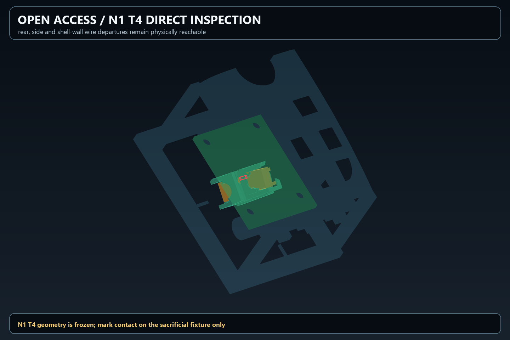

# 72 — SZH-EK056 actual-part physical fit test fixture

## 1. Status

이 결과는 **TEST FIXTURE / SACRIFICIAL PROTOTYPE**이다. Production OneGrip geometry가 아니다.

| gate | result |
|---|---|
| local printable fit fixture | **GENERATED / PASS** |
| actual SZH-EK056 integration | **HOLD — PHYSICAL TEST REQUIRED** |
| stock knob as final packaging constraint | **EXCLUDED** |
| custom OneGrip knob adapter | **NOT CREATED** |
| N1/N2 production geometry modification | **0** |
| Finger / Thumb / shell production geometry modification | **0** |

실물 결과가 나오기 전에는 provisional `PCB ↔ N1/N2`, `N1 T4 ≈ 1.108 mm`, shaft/gimbal sweep, wiring HOLD를 해결하기 위한 production 수정으로 넘어가지 않는다.

## 2. Deliverables

Mandatory assembly는 실제 OneGrip world coordinate에 놓인 fixture body와 N1/N2 carrier를 함께 보존한다.

| file | purpose | bytes | SHA-256 |
|---|---|---:|---|
| `build123d_workbench/out/szh_actual_fit_fixture/SZH_EK056_ACTUAL_FIT_FIXTURE.step` | labeled world-coordinate assembly | 7,255,751 | `80193369d6bde8d8e32564a8ef92a31eb5f31539bcf38423559e7d2b75e821e4` |
| `build123d_workbench/out/szh_actual_fit_fixture/SZH_EK056_ACTUAL_FIT_FIXTURE.stl` | mandatory multi-body mesh | 2,656,984 | `b6bf538f6116f238fb3596f3d8116e06c4bc1bcb852b525d6d1c8b03dfa8f822` |
| `build123d_workbench/out/szh_actual_fit_fixture/SZH_EK056_ACTUAL_FIT_FIXTURE_BODY.step` | shell/Backplate/sacrificial frame print split | 6,484,410 | `6ee89d0918bb8e79876cac8f7d4c74d0233c318b1f22a2d20c667ea9294b0bb9` |
| `build123d_workbench/out/szh_actual_fit_fixture/SZH_EK056_ACTUAL_FIT_FIXTURE_BODY.stl` | recommended body print | 2,558,184 | `fb3d6c40a94dc6b29a00d9d16ff2f40da00e04023ff7d4fc6d96f5a0c470db48` |
| `build123d_workbench/out/szh_actual_fit_fixture/SZH_EK056_ACTUAL_FIT_FIXTURE_N1_N2_CARRIER.stl` | approved carrier exact-copy print split | 107,684 | `14b0ba5426e7299944c411f88ca02d95dd6ad27f65e64fa3212e23cc336096fb` |
| `build123d_workbench/out/szh_actual_fit_fixture/szh_ek056_actual_fit_fixture.json` | coordinates, hashes, crop, support and memory record | — | generated record |

Generator: `build123d_workbench/szh_actual_fit_fixture.py`.

### Recommended print set

Mandatory STL은 조립 좌표 검증용 multi-body다. 실제 출력은 다음 두 파일을 쓰는 편이 안전하다.

1. `SZH_EK056_ACTUAL_FIT_FIXTURE_BODY.stl`
2. `SZH_EK056_ACTUAL_FIT_FIXTURE_N1_N2_CARRIER.stl`

단위는 **mm**다. Body는 slicer에서 한 개의 rigid body로 회전할 수 있지만, 내부 shell/Backplate component를 따로 자동 정렬하면 안 된다. N1/N2 carrier는 별도 출력한 뒤 승인된 seating position에 넣는다. Carrier fastening boss는 이번 범위에서 만들지 않았으므로 필요하면 외부 비기능 면에 low-tack putty 또는 테이프를 임시로 사용한다.

## 3. Preserved coordinate frame

| datum | value |
|---|---|
| approved joystick pivot datum, world mm | `(-0.216040, -23.149077, 40.496179)` |
| joystick axis / local +Z | `(0.000181854, 0.598493369, 0.801127739)` |
| local +X | `(0.001022863, -0.801127445, 0.598492917)` |
| local +Y | `(0.999999460, 0.000710605, -0.000757865)` |
| source geometry translation | `0.000 mm` |
| source geometry rotation | `0.000°` |
| original Backplate mount-hole centre plane | local `Z = 1.000000 mm` |
| local crop | `51 × 36 × 43 mm` |

JaD/JfD current shell과 lowered original Thumb Backplate는 위 좌표에서 잘라낸 local exact section이다. Crop boundary와 별도 희생형 frame/support만 새 geometry다. Shell inner surface, opening, N1/N2 상대 위치, Backplate mount reference는 이동하지 않았다.

Web reference의 `1.8 mm` axial sensitivity는 렌더에서 approximate module을 놓는 참고값일 뿐이다. 실제 모듈을 강제로 그 위치에 고정하는 hard locator는 만들지 않았다.

## 4. Fixture architecture

- Body: current JaD/JfD local shell section + lowered Backplate local section.
- Sacrificial foundation: open-centre `59 × 43 × 3 mm` frame.
- Structural links: crop 외곽에만 붙는 `3.2 mm` section support 6개.
- Carrier: docs/63 이후 승인된 N1/N2 carrier의 무수정 복사본.
- Printed switch: 없음. 실제 ITS-1105 또는 실측 dummy를 carrier에 넣는다.
- Printed joystick: 없음. 실제 SZH-EK056를 넣는다.
- Stock knob: 제거 상태로 시험한다.
- Stock header: 유지 상태로 시험한다.

Foundation의 중앙 후면, PCB/header 측면, N1/N1-T4 측면, N2 측면, shaft/gimbal 외측 opening이 열려 있다. `1.0–1.3 mm` wire 한 가닥을 rear / side / shell-wall 방향으로 직접 대볼 수 있다.

Embossed labels:

`N1`, `N2`, `PCB DATUM`, `JOYSTICK AXIS`, `+X`, `-X`, `+Y`, `-Y`, `N1 T4 CHECK`, `TEST ONLY`.

## 5. Print and preparation

1. Body와 carrier를 출력한다. Body의 여섯 support link와 foundation은 제거하지 않는다.
2. Stringing 또는 support residue는 access window에서만 제거한다. Shell inner surface, Backplate mount reference, carrier seating surface는 사포로 보정하지 않는다.
3. Carrier를 정확한 seating position에 dry-fit한다. 임시 고정재는 terminal/joystick 쪽이 아닌 외부 비기능 면에만 쓴다.
4. 실제 또는 dummy ITS-1105를 N1/N2에 넣는다. N1 T4를 절단·굽힘·연마하지 않는다.
5. 실제 SZH-EK056 stock knob를 제거한다. Stock header와 pin은 그대로 둔다.
6. 열린 후면에서 모듈을 손으로 넣어 neutral shaft를 OneGrip opening/axis에 맞춘다. Web-reference mounting holes에 억지로 맞추지 않는다.
7. 접촉 확인에는 얇은 마커, transfer ink, 종이/필름 feeler를 사용한다. 실제 부품 또는 production source를 갈아내지 않는다.

지그가 먼저 닿는 경우에만 fixture 내부를 파일/사포/rotary tool로 relief한다. Relief 위치와 대략 깊이를 아래 표에 기록한다.

## 6. Measurement sheet

### 6.1 Actual module metrology

| measurement | actual result | method / note |
|---|---|---|
| MODULE PCB X | `_____ mm` | caliper |
| MODULE PCB Y | `_____ mm` | caliper |
| MODULE PCB Z / thickness | `_____ mm` | bare PCB thickness |
| mounting-hole X pitch | `_____ mm` | hole centre-to-centre |
| mounting-hole Y pitch | `_____ mm` | hole centre-to-centre |
| mounting-hole diameter | `_____ mm` | 4 holes individually if different |
| joystick centre from PCB X datum | `_____ mm` | sign follows fixture labels |
| joystick centre from PCB Y datum | `_____ mm` | sign follows fixture labels |
| ACTUAL MOUNTING POSITION local X | `_____ mm` | relative to labeled axis/datum |
| ACTUAL MOUNTING POSITION local Y | `_____ mm` | relative to labeled axis/datum |
| ACTUAL MOUNTING POSITION local Z | `_____ mm` | relative to Backplate mount plane |
| X potentiometer max envelope | `_____ × _____ × _____ mm` | include terminals |
| Y potentiometer max envelope | `_____ × _____ × _____ mm` | include terminals |
| bottom switch max envelope | `_____ × _____ × _____ mm` | include solder legs |
| stock header max envelope | `_____ × _____ × _____ mm` | plastic + pins |

### 6.2 Shaft / future knob interface

Original printable knob reference bore is approximately `4.150813 × 3.150000 mm`, depth `9.000 mm`. 이것을 근거로 실물 shaft를 PASS 처리하지 않는다.

| measurement | actual result | note |
|---|---|---|
| SHAFT PROFILE | `ROUND / D / KEYED / OTHER: _____` | photo/sketch 권장 |
| SHAFT X | `_____ mm` | maximum section |
| SHAFT Y | `_____ mm` | orthogonal maximum section |
| exposed shaft length | `_____ mm` | housing/shoulder to end |
| available insertion length | `_____ mm` | usable knob engagement only |
| shoulder / step position | `_____ mm` | if present |
| original knob direct fit | `YES / NO / UNKNOWN` | force-fit 금지 |

### 6.3 N1/N2 physical contact

| check | result |
|---|---|
| N1 CONTACT | `NONE / TOUCH / INTERFERENCE` |
| N1 INTERFERENCE LOCATION | `________________________________` |
| N1 T4 direct contact | `NONE / TOUCH / INTERFERENCE` |
| N1 MANUAL RELIEF REQUIRED | `_____ mm approximate / NONE` |
| N2 CONTACT | `NONE / TOUCH / INTERFERENCE` |
| N2 INTERFERENCE LOCATION | `________________________________` |
| N2 MANUAL RELIEF REQUIRED | `_____ mm approximate / NONE` |
| stock header blocks insertion | `YES / NO` |
| stock header contact location | `________________________________` |

### 6.4 Shaft/gimbal tilt

Neutral shaft를 `JOYSTICK AXIS`에 맞춘 뒤 stock knob 없이 천천히 움직인다. 억지로 hard stop을 넘기지 않는다.

| direction | result | first contact location / note |
|---|---|---|
| CENTER | `FREE / TOUCH / BLOCKED` | `____________________________` |
| +X TILT | `FREE / TOUCH / BLOCKED` | `____________________________` |
| -X TILT | `FREE / TOUCH / BLOCKED` | `____________________________` |
| +Y TILT | `FREE / TOUCH / BLOCKED` | `____________________________` |
| -Y TILT | `FREE / TOUCH / BLOCKED` | `____________________________` |
| observed maximum +X | `_____° / _____ mm at shaft end` | method: `_____` |
| observed maximum -X | `_____° / _____ mm at shaft end` | method: `_____` |
| observed maximum +Y | `_____° / _____ mm at shaft end` | method: `_____` |
| observed maximum -Y | `_____° / _____ mm at shaft end` | method: `_____` |

### 6.5 One-wire departure probe

`1.0–1.3 mm` class insulated wire 한 가닥만 손으로 대본다. Production channel을 만들거나 carrier를 깎지 않는다.

| route | result | tight/contact location |
|---|---|---|
| REAR WIRE DEPARTURE | `CLEAR / TIGHT / BLOCKED` | `____________________________` |
| SIDE WIRE DEPARTURE | `CLEAR / TIGHT / BLOCKED` | `____________________________` |
| SHELL-WALL DEPARTURE | `CLEAR / TIGHT / BLOCKED` | `____________________________` |
| preferred physical route | `REAR / SIDE / SHELL-WALL / NONE` | `____________________________` |

## 7. Review renders

Web module의 green PCB/colored body는 위치 설명용 translucent reference다. STEP/STL print geometry에는 포함되지 않는다.

## 8. Verification record

| verification | result |
|---|---|
| mandatory STEP re-import | **PASS** |
| STEP solid count | `74` |
| STEP leaf-solid volume sum, serialization diagnostic only | `15157.361121 mm³` |
| nested root mass property, serialization diagnostic only | `4127.525150 mm³` |
| canonical carrier ↔ exported carrier | **EXACT COPY / distance 0.000000 mm** |
| web PCB/gimbal/header/shaft solids in fixture STEP | **ABSENT** |
| local full-shell crop operations | `2`, serial |
| full shell STEP/STL export | `0` |
| web joystick exported into fixture | `NO` |
| custom knob/adapter generated | `NO` |
| source hash before/after | **IDENTICAL** |
| peak process RSS | `525.3 MB` |
| production geometry modification | **0** |

Key frozen source guards:

| source | SHA-256 |
|---|---|
| `N1_N2_SHARED_CARRIER_N1_LOCAL.step` | `2485e34f8716395459f1f7b10384fd73a33695472f9aae689cf321d583830756` |
| `JAD_FINGER_V2.step` | `a477aa79e55ddb21fb2a45c7f616544f6eb4844b593f61cf7d45303476c5a762` |
| `JFD_FINGER_V2.step` | `d457d5d9b305a4c7d77e21aab3cb7d33336d672d4d8bf031e6158de44c26ad50` |
| `THUMB_TARGET_EXACT_MODULE.step` | `adc870ffaf55a9342d62df89f162827a744bdf1d43060c0fbb69f7c8e8089fe9` |

## 9. Stop gate

실물 측정표와 contact/tilt/wire 결과가 채워질 때까지:

- N1/N2 terminal 수정 금지
- N1/N2 carrier 수정 금지
- Thumb/shell 수정 금지
- SZH mounting adapter production 설계 금지
- final wire channel 생성 금지
- custom knob bore/adapter 변경 금지

**STOP — actual SZH-EK056 physical result required.**
