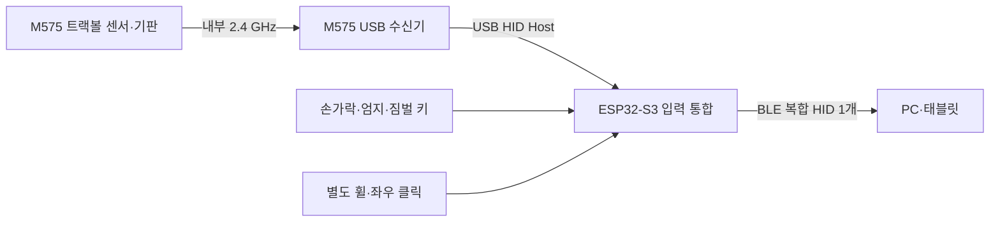
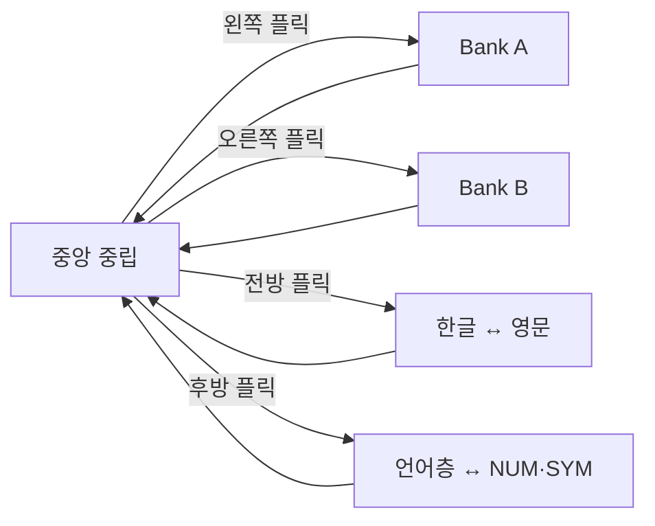

# 버티컬 트랙볼 한손 키보드 시제품 개발 계획

> 목표: 2026년 8월 28일까지 한 손으로 문자 입력과 포인터 조작이 가능한 작동 시제품 완성  
> 예산 상한: 700,000원  
> 조달 원칙: 국내 판매처 및 빠른 배송 우선  
> 제작 원칙: 맞춤 PCB와 만능기판을 사용하지 않고 완성 개발보드와 기존 트랙볼 기판만 사용

## 1. 결론

아래 범위라면 8월 28일까지 개발 가능하다.

- 검지·중지·약지·소지용 U자형 손가락 타워 4개
- 손가락마다 `왼쪽 밀기 / 중앙 누르기 / 오른쪽 밀기` 3입력
- 상부 그립 전체를 조종간처럼 플릭하는 2축 입력
- 엄지 위치의 트랙볼, 트랙볼 우측 스크롤 휠, 트랙볼 아래 좌·우 클릭
- 엄지 특수키 6개와 영문 보조키 1개
- ESP32-S3 단일 Bluetooth 복합 HID 키보드·마우스 기능
- 3D 프린팅 본체, 조절식 타워, 중수골 스트랩

다만 다음은 이번 시제품 범위에서 제외한다.

- 자체 광학 트랙볼 센서 개발
- 맞춤 PCB 제작과 만능기판 조립
- 모바일 설정 앱, 자동 손 크기 측정, RGB 장식
- 양산 수준의 방수·낙하·배터리 인증

트랙볼은 로지텍 M575의 볼·센서·무선 기판과 동봉 USB 수신기를 한 세트로 이식한다. M575 수신기는 기기 내부에서 ESP32-S3의 USB Host에 연결하고, ESP32-S3가 포인터 이동값과 키보드·클릭·스크롤 입력을 하나의 Bluetooth 복합 HID 보고서로 합친다. 컴퓨터에는 `GripKey One` 한 장치만 표시되며 Bluetooth도 한 번만 페어링한다.



## 2. 최종 조작 방식

### 2.1 조종간 플릭

바닥은 책상에 고정하고 손이 잡는 상부 그립만 중앙 짐벌을 기준으로 움직인다. 입력 후 스프링으로 중앙에 복귀하며, 선택된 상태는 유지된다.

| 그립 동작 | 기능 | 복귀 후 상태 |
|---|---|---|
| 왼쪽으로 플릭 | Bank A 선택 | Bank A 유지 |
| 오른쪽으로 플릭 | Bank B 선택 | Bank B 유지 |
| 앞으로 밀기 | 한글 ↔ 영문 전환 | 선택 언어 유지 |
| 뒤로 당기기 | 언어층 ↔ 숫자·기호층 전환 | 선택 층 유지 |

`Rank A/B`가 아니라 키 묶음을 뜻하는 `Bank A/B`로 표기한다.



대각선 오입력을 막기 위해 짐벌 외곽에 십자형 게이트를 둔다. 펌웨어는 중앙 복귀 전에는 두 번째 방향을 받지 않고, 최초로 눌린 방향 스위치 하나만 처리한다.

### 2.2 손가락 입력

각 손가락은 U자형 지지대 안에 들어가며, 지문이 닿는 위치에 넓고 평평한 로커 캡을 둔다.

- 손가락을 왼쪽으로 밀기: 첫 번째 입력
- 캡 중앙을 아래로 누르기: 두 번째 입력
- 손가락을 오른쪽으로 밀기: 세 번째 입력
- 손가락을 떼면 캡이 중앙으로 복귀한 뒤 다음 입력 허용

한 타워는 KW-10 마이크로스위치 3개와 3D 프린팅 로커 캡으로 구성한다. 캡은 수평축을 중심으로 좌우 회전하고, 중앙에는 짧은 독립 플런저를 넣어 중앙 누름이 좌우 스위치를 건드리지 않게 한다.

권장 초기 치수는 다음과 같다.

| 항목 | 초기값 |
|---|---:|
| 좌우 캡 이동량 | 각 1.5~2.0 mm |
| 중앙 누름 이동량 | 0.8~1.2 mm |
| 목표 손끝 작동력 | 0.5~0.9 N |
| 타워 중심 간격 | 19~22 mm |
| 타워 전후 조절 | ±8~10 mm |
| 타워 각도 조절 | ±10° |

검지·중지·약지·소지의 길이를 같게 만들지 않는다. 중지를 기준으로 검지는 약 3~5 mm, 약지는 6~8 mm, 소지는 13~17 mm 낮게 시작한다. 소지 타워는 손바닥 쪽으로 8~12° 회전시켜 자연스럽게 닿게 한다. 실제 수치는 첫 사용자 손 본뜨기 후 수정한다.

### 2.3 엄지 조작부

- 트랙볼: 엄지의 자연스러운 휴식 위치
- 스크롤 휠: 트랙볼 바로 우측
- 좌클릭·우클릭: 트랙볼 바로 아래의 독립 패들
- 기본 엄지키 세로 순서: `Space → Backspace → Shift → Enter → Ctrl → Alt`
- 영문 보조키 **1개**: Space 옆의 별도 작은 키. Bank A에서는 `U`, Bank B에서는 `Z`

U/Z 키는 세로 배열 사이에 끼우지 않는다. Space 옆, 트랙볼에 가까운 별도 위치에 두어 기존 여섯 엄지키의 순서와 도달성을 유지한다.

엄지 영역은 위에서부터 다음 세 구역으로 고정한다.

1. 엄지의 자연스러운 휴식 위치: 트랙볼
2. 트랙볼 우측과 바로 아래: 스크롤 휠, 좌클릭, 우클릭
3. 클릭키 아래의 엄지 회전 호: Space, Backspace, Shift, Enter, Ctrl, Alt와 U/Z 보조키 1개

따라서 트랙볼을 조작하는 엄지가 크게 이동하지 않고 포인터, 스크롤, 클릭, 공백·삭제·조합키를 연속해서 사용할 수 있어야 한다.

중수골 스트랩은 손목을 묶지 않고 손등 중앙을 폭 35~45 mm로 지지한다. 양쪽 끝은 본체에 고정하고 엄지 아래쪽과 Alt 키 방향을 비워 둔다. 스트랩은 벨크로 방식으로 한 손으로도 빠르게 풀 수 있어야 한다.

## 3. 키 배치

### 3.1 영문

팀에서 만든 배치를 그대로 구현 가능한 형태로 정리했다. 네 손가락 12입력과 엄지 보조키 1개를 두 Bank로 나누면 영문 26자를 모두 배치할 수 있다.

#### Bank A

| 동작 | 검지 | 중지 | 약지 | 소지 | 엄지 보조키 |
|---|---|---|---|---|---|
| 왼쪽 밀기 | T | I | H | L |  |
| 중앙 누르기 | E | O | S | D | U |
| 오른쪽 밀기 | A | N | R | C |  |

#### Bank B

| 동작 | 검지 | 중지 | 약지 | 소지 | 엄지 보조키 |
|---|---|---|---|---|---|
| 왼쪽 밀기 | W | G | V | X |  |
| 중앙 누르기 | M | Y | B | J | Z |
| 오른쪽 밀기 | F | P | K | Q |  |

### 3.2 한글·숫자·기호

한글과 숫자·기호는 같은 물리 스위치를 사용하되 펌웨어 표만 변경한다. 1차 완성 순서는 `영문 → 한글 → 숫자·기호`다. 영문이 안정되지 않으면 나머지 층을 먼저 늘리지 않는다.

- 전방 플릭은 운영체제 한/영 HID 코드로 전환한다.
- 대상 Windows PC에서 한/영 HID 코드가 동작하지 않으면 오른쪽 Alt 방식으로 대체한다.
- 후방 플릭으로 NUM·SYM 층에 들어가고, 다시 후방 플릭하면 마지막으로 사용한 언어층으로 돌아온다.
- Shift·Ctrl·Alt는 누른 채 조합할 수 있도록 손가락 매트릭스와 별도 GPIO에 연결한다.

## 4. 2축 짐벌 구조

권장 구조는 두 개의 직교 회전축을 겹친 카르단 짐벌이다.

- 좌우축 제한: ±7°
- 전후축 제한: 전방 +5°, 후방 -5°
- 네 방향에 KW-10 리미트 스위치 1개씩 배치
- 네 개의 인장 스프링 또는 두 축의 토션 스프링으로 중앙 복귀
- 십자형 게이트와 기계식 하드스톱으로 대각선 이동 방지
- 축에는 M4 또는 M5 볼트와 부싱을 사용하고, 출력물끼리 직접 마찰시키지 않음
- 상부와 하부 사이 배선은 축을 감지 않는 느슨한 S자 루프로 통과

처음부터 전체 본체를 출력하지 않는다. 1:1 크기의 짐벌 시험 지그만 먼저 출력하여 네 방향 인식, 복귀, 스프링 강도를 검증한다.

펌웨어 처리 순서는 다음과 같다.

1. 방향 스위치가 20 ms 이상 유지되면 한 번 입력한다.
2. 해당 방향의 상태를 변경하고 이후 방향 입력을 잠근다.
3. 네 스위치가 모두 해제된 중앙 상태가 80 ms 유지되면 잠금을 푼다.
4. 동시에 두 방향이 감지되면 먼저 들어온 방향만 인정한다.
5. 플릭 결과는 LED 점멸 횟수 또는 짧은 진동 패턴으로 확인한다.

## 5. PCB 없는 전기 설계

여기서 `PCB를 쓰지 않는다`는 의미는 다음과 같다.

- 맞춤 PCB 발주 없음
- 만능기판·브레드보드를 최종 기기 안에 넣지 않음
- 손가락·엄지·짐벌 스위치용 모듈 PCB 사용 안 함
- 완성 ESP32-S3 개발보드와 M575의 기존 제조 기판만 유지
- 모든 스위치는 전선, JST 커넥터, 수축튜브로 직결

Bluetooth HID와 USB Host를 구현하려면 MCU가 실장된 완성 ESP32-S3 개발보드는 필요하다. MCU 칩까지 공중배선하는 것은 일정과 신뢰성 모두에서 부적합하다.

### 5.1 입력 배선

손가락 스위치 12개와 엄지키 7개를 합쳐 `6행 × 4열` 키 매트릭스로 묶는다.

- 행 1~4: 검지·중지·약지·소지
- 행 5~6: 엄지키 7개
- 열 1~3: 손가락의 왼쪽·중앙·오른쪽 입력
- 열 4: 엄지키 배치를 완성하기 위한 추가 열
- 키 19개 각각에 1N4148 다이오드 1개를 인라인 납땜
- 다이오드와 접합부는 개별 수축튜브로 절연
- 타워마다 JST 커넥터를 두어 통째로 교체 가능하게 구성

모든 키에 다이오드가 있으므로 Shift·Ctrl·Alt와 손가락키를 동시에 눌러도 고스팅을 막을 수 있다. 짐벌 4방향, 좌·우 클릭, EC11 스크롤 신호는 키 매트릭스와 분리해 독립 입력으로 연결한다.

| 입력군 | GPIO 수 |
|---|---:|
| 손가락·엄지 6×4 매트릭스 | 10 |
| 짐벌 네 방향 | 4 |
| 좌·우 클릭 | 2 |
| EC11 스크롤 A/B | 2 |
| 합계 | 18 |

ESP32-S3 44핀형으로 여유 있게 처리 가능한 범위다. USB Host용 GPIO 19·20은 키 입력에 사용하지 않는다. 부팅 스트랩 핀과 플래시·PSRAM 전용 핀도 피하고, 실제 핀 번호는 펌웨어 폴더의 핀맵 파일 하나에서만 관리한다.

### 5.2 단일 Bluetooth 트랙볼·키보드 통합

- 기존 볼 컵, 센서, M575 기판, AA 홀더는 하나의 트랙볼 카세트로 고정
- M575를 동봉 USB 수신기와 연결하고 수신기를 기기 내부 USB Host 배선에 고정
- ESP32-S3가 수신기의 USB HID 마우스 보고서에서 X/Y 이동값만 읽음
- M575 원래 휠·버튼값은 버리고 출력물과 닿지 않게 내부에서 보호
- 별도 EC11 엔코더를 트랙볼 우측에 장착해 스크롤값 생성
- 트랙볼 아래 KW-10 두 개로 좌클릭·우클릭 생성
- ESP32-S3가 X/Y, 휠, 버튼과 모든 키 입력을 하나의 BLE 복합 HID 보고서로 전송
- PC에서는 `GripKey One` 하나만 페어링

ESP32-S3는 USB HID 마우스를 읽는 USB Host와 키보드·마우스 보고서를 보내는 BLE HID Device를 각각 지원한다. 이번 펌웨어는 두 공식 기능을 하나의 입력 큐로 연결하는 브리지다. [Espressif USB Host HID 설명](https://docs.espressif.com/projects/esp-usb/en/latest/esp32s3/usb_host.html), [Espressif BLE HID 예제](https://github.com/espressif/esp-idf/tree/master/examples/bluetooth/bluedroid/ble/ble_hid_device_demo)

BLE 보고서 구조는 다음으로 고정한다.

- Report ID 1: 키보드 수정키와 최대 6키
- Report ID 2: 마우스 버튼, X, Y, 스크롤 휠
- 장치명: `GripKey One`
- M575 수신기에서 들어오는 버튼·휠 값은 무시하고 X/Y만 합산
- 자체 좌·우 클릭과 EC11 휠은 Report ID 2에 추가

### 5.3 전원

- M575: 원래 AA 배터리 1개 유지
- ESP32: 베이스 안의 AA Ni-MH 4개 직렬 홀더와 전원 스위치 사용
- 충전은 배터리를 꺼내 외부 충전기에서 수행
- USB로 ESP32를 프로그래밍할 때는 배터리 전원을 분리
- 배터리와 전자부품 사이에 절연 격벽 배치

충전 모듈을 추가하지 않아 PCB와 배터리 안전 리스크를 동시에 줄인다.

## 6. 국내 조달 BOM

가격은 2026년 8월 9일 확인 또는 국내 소매가 기준의 안전 예산이다. 결제 직전 재고, 배송 예정일, VAT와 배송비를 다시 확인한다.

| 구분 | 부품 | 수량 | 단가 | 소계 | 국내 조달처·비고 |
|---|---|---:|---:|---:|---|
| 트랙볼 | Logitech ERGO M575 정품 | 2 | 41,700 | 83,400 | [다나와 가격비교](https://prod.danawa.com/info/?pcode=13373132), 1개 이식·1개 예비 |
| 통합 MCU | LOLIN S3 V1.0.0 ESP32-S3 | 2 | 17,600 | 35,200 | [디바이스마트](https://www.devicemart.co.kr/goods/view?no=15164113), USB OTG·BLE, 준비 1~2일 표시 |
| 내부 USB | USB-A 암 커넥터·OTG 배선·전원 보호 | 2세트 | 5,000 | 10,000 | M575 수신기 내부 연결, 1세트 예비 |
| 손가락·짐벌·클릭 | KW-10 마이크로스위치 | 22 | 517 | 11,374 | [디바이스마트](https://www.devicemart.co.kr/goods/view?no=13764), 준비 1~2일 표시 |
| 스크롤 | bare EC11 엔코더·휠 | 2세트 | 4,000 | 8,000 | [다이코리아 EC11](https://diykorean.com/Product/?idx=819), 1세트 예비 |
| 엄지키 | 관통형 택트 스위치·키캡 | 1묶음 | 6,500 | 6,500 | 국내 부품몰에서 10개 이상, 모듈형 제외 |
| 매트릭스·표시 | 1N4148, 저항, LED 등 | 1묶음 | 8,000 | 8,000 | [국내 재고 1N4148](https://www.devicemart.co.kr/goods/view?no=25) |
| 배선 | JST-XH, 실리콘선, 수축튜브, 슬리브 | 1묶음 | 30,000 | 30,000 | 국내 부품몰 묶음 주문 |
| 전원 | AA Ni-MH 4개, 홀더, 충전기, 스위치 | 1묶음 | 35,000 | 35,000 | 국내 오픈마켓 |
| 짐벌·조절부 | 축, 부싱, 스프링, M2~M5 볼트, 인서트 | 1묶음 | 45,000 | 45,000 | 국내 철물·3D 프린터 부품몰 |
| 손 지지 | 중수골 스트랩, 벨크로, 네오프렌, EVA | 1묶음 | 25,000 | 25,000 | 국내 재활·원단·오픈마켓 |
| 출력 1차 | PLA/PETG 기능 시제품 | 1회 | 90,000 | 90,000 | 24~48시간 국내 FDM 업체 기준 |
| 출력 2차 | PETG 본체+TPU 접촉부 | 1회 | 150,000 | 150,000 | 최종 출력 |
| 마감 | 미끄럼패드, 라벨, 접착제, 도색 | 1묶음 | 20,000 | 20,000 | 국내 문구·철물몰 |
| 공구·소모품 | 압착공구, 납, 플럭스, 예비 팁 | 1묶음 | 25,000 | 25,000 | 보유 시 절감 가능 |
| 빠른 배송 | 택배·퀵·추가 배송비 | 1식 | 30,000 | 30,000 | 일정 보호 예산 |
| 예비비 | 재출력·파손·부품 교체 | 1식 | 70,000 | 70,000 | 승인 후 사용 |
|  | **총계** |  |  | **682,474원** | **상한 대비 17,526원 여유** |

### 주문 우선순위

오늘 바로 주문할 핵심 부품은 M575 2개, LOLIN ESP32-S3 2개, USB-A 암 커넥터·OTG 배선 2세트, KW-10 22개, EC11 2개, 1N4148, 커넥터와 배선이다. M575 상품에 USB 수신기가 포함되는지 결제 전에 반드시 확인한다. 이 부품이 없으면 CAD 치수를 확정하거나 단일 Bluetooth 브리지를 실기 테스트할 수 없다.

배송이 오래 걸리는 5-way 조이스틱, 해외구매 표시 제품, SMT 전용 스위치는 이번 핵심 경로에서 제외한다. 필요하면 차기 버전 비교용으로만 구매한다.

## 7. 8월 28일까지 일정

### 8월 9일 일요일 — 범위 고정·주문

- 이 문서 기준으로 기능 동결
- 국내 부품 전량 주문
- GitHub 저장소에 `cad`, `firmware`, `docs`, `test` 폴더 생성
- 조달 담당자가 도착 예정일을 표에 기록

### 8월 10~11일 — 단일 Bluetooth 통합·스위치 선행 시험

- ESP32-S3 USB Host에서 M575 수신기 인식과 X/Y 보고서 수신
- 수신한 X/Y와 자체 클릭·스크롤을 BLE 복합 HID 한 장치로 재전송
- KW-10 3개를 사용한 손가락 타워 1개 제작
- 6×4 매트릭스와 다이오드 공중배선 시험
- 조종간 네 방향 상태 머신 구현

**11일 종료 기준:** PC에 `GripKey One` 한 장치만 페어링한 상태에서 M575 커서 이동, 자체 좌·우 클릭, 자체 스크롤, 영문 키 하나가 모두 동작해야 한다. 통과하지 못하면 외형 CAD 작업 인원을 줄이고 12일까지 통합 펌웨어를 최우선으로 해결한다.

### 8월 12~14일 — 실측·짐벌·도달성 검증

- M575 도착 즉시 외형 분해 전 사진 기록
- 볼 컵·센서·기판·배터리 카세트 치수 측정
- 십자 게이트 2축 짐벌 시험 지그 출력
- 폼보드 또는 저해상도 출력물로 엄지 도달 범위 확인
- 중지 기준으로 네 타워 높이와 각도 결정

**14일 종료 기준:** 짐벌이 네 방향으로 독립 입력되고 중앙 복귀해야 한다. 실패하면 볼 조인트 대신 두 직교축 구조로 즉시 단순화한다.

### 8월 15~17일 — 1차 본체 제작

- 상부 그립, 타워 레일, 엄지 포드, 짐벌 베이스 1차 출력
- M575 카세트와 AA 전원함 조립
- JST 하네스 제작
- 중수골 스트랩 고정점 설치

### 8월 18~19일 — 통합·첫 사용자 시험

- 영문 26자, Bank A/B, 한/영, NUM·SYM 전환 통합
- 트랙볼, 휠, 클릭 동시 사용 확인
- 멘토 또는 사용자의 20분 시험
- 기록: 오입력, 손가락별 작동 실패, 엄지 도달, Bank 오전환, 피로 위치

### 8월 20일 — 설계 동결

- 타워 위치, 엄지키 위치, 짐벌 각도만 수정
- 새로운 기능 추가 금지
- 최종 출력 파일 확정

### 8월 21~23일 — 최종 출력

- PETG 구조물과 TPU 접촉부 출력
- 출력 대기 중 펌웨어 디바운스와 키맵 완성
- 예비 ESP32-S3에 동일 통합 펌웨어 업로드

### 8월 24~25일 — 최종 조립

- 직결 하네스, 수축튜브, 스트레인 릴리프 마감
- 타워별 교체와 정비 가능 여부 확인
- 배터리함과 전선이 짐벌 이동을 방해하지 않는지 확인

### 8월 26일 — 검증

- 각 손가락 100회씩 총 400회 입력 시험
- 짐벌 각 방향 100회씩 총 400회 플릭 시험
- 2시간 연속 연결·입력 시험
- 전원 껐다 켠 뒤 3분 안에 재연결되는지 확인

### 8월 27일 — 발표 준비

- 키맵 라벨, 사용 순서 카드, 예비 기기와 공구 포장
- 1분 작동 영상 촬영
- 예비 ESP32-S3, M575 수신기, USB Host 배선과 동일 펌웨어 준비

### 8월 28일 금요일 — 납품

- 새 기능 개발 금지
- 오전에는 최종 기능 확인과 경미한 수리만 수행
- 작동 시제품, 영상, BOM, 테스트 기록을 함께 제출

## 8. 완료 기준

다음 항목을 모두 통과해야 `개발 완료`로 본다.

- 네 타워가 손가락과 1:1로 대응한다.
- 각 타워에서 좌·중앙·우 입력이 100회 중 95회 이상 정확하다.
- 짐벌 네 방향이 서로 섞이지 않고 100회 중 98회 이상 상태를 바꾼다.
- 엄지가 손바닥 위치를 바꾸지 않고 트랙볼, 휠, 좌·우 클릭, Space, Backspace에 닿는다.
- Ctrl·Alt까지 사용할 때 스트랩이 엄지 이동을 막지 않는다.
- 영문 26자와 Space, Backspace, Shift, Enter, Ctrl, Alt가 입력된다.
- Bank A/B, 한/영, 언어층/NUM·SYM 전환이 화면 또는 LED로 확인된다.
- PC Bluetooth 목록에는 `GripKey One` 한 장치만 연결된다.
- 20분 사용 중 본체가 넘어가거나 책상 위에서 이동하지 않는다.
- 전선이 노출되지 않고 각 타워를 커넥터로 교체할 수 있다.

## 9. 가장 큰 위험과 대응

| 위험 | 조기 확인일 | 대응 |
|---|---|---|
| KW-10 작동력이 무거움 | 8월 11일 | 캡 지렛대 길이를 늘리고 스위치 접점을 회전축에 가깝게 이동 |
| 중앙 누름 때 좌우가 함께 눌림 | 8월 11일 | 독립 플런저와 좌우 유격 0.5 mm 추가 |
| 짐벌 대각선 오입력 | 8월 14일 | 십자 게이트 폭 축소, 최초 입력 잠금 적용 |
| 엄지가 Alt까지 닿지 않음 | 8월 14일 | 엄지키를 직선이 아닌 회전 호로 배치하고 스트랩 폭 축소 |
| M575 분해 중 파손 | 도착 즉시 | 두 번째 M575를 미개봉 예비로 보관 |
| USB Host·BLE 브리지 불안정 | 8월 11일 | ESP-IDF USB HID·BLE HID 공식 예제를 먼저 결합하고 버전을 고정, 예비 S3와 M575 수신기로 교차시험 |
| 최종 출력 지연 | 8월 20일 | 1차 출력물도 전 기능을 유지하도록 설계 |

## 10. GitHub 권장 구조

```text
.
├─ README.md
├─ bom/
│  └─ domestic-bom.csv
├─ cad/
│  ├─ tower/
│  ├─ gimbal/
│  ├─ thumb-pod/
│  └─ enclosure/
├─ firmware/
│  └─ esp32-s3-single-hid/
├─ docs/
│  ├─ wiring.md
│  ├─ keymap.md
│  └─ assembly.md
└─ test/
   ├─ input-test.csv
   └─ mentor-feedback.md
```

## 11. 개발 원칙

1. 모듈 하나를 검증하기 전 전체 타워를 출력하지 않는다.
2. 사용자 도달성과 작동력을 외형보다 먼저 본다.
3. 8월 20일 이후에는 기능을 추가하지 않는다.
4. PC에는 키보드와 마우스가 포함된 BLE 복합 HID 한 장치만 노출한다.
5. 최종 시제품에는 브레드보드, 만능기판, 느슨한 점퍼선을 넣지 않는다.
6. 모든 가격과 재고는 주문 시점에 다시 확인한다.
