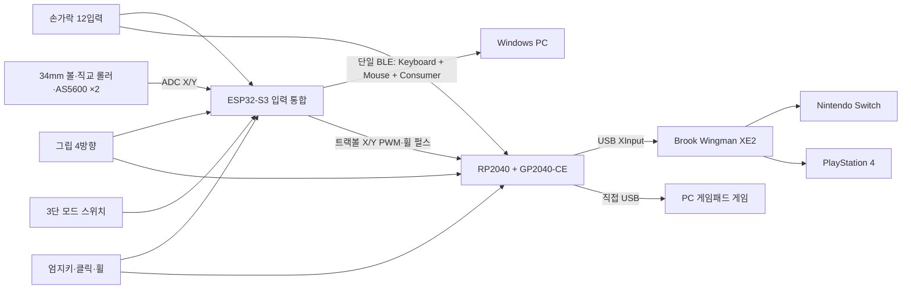
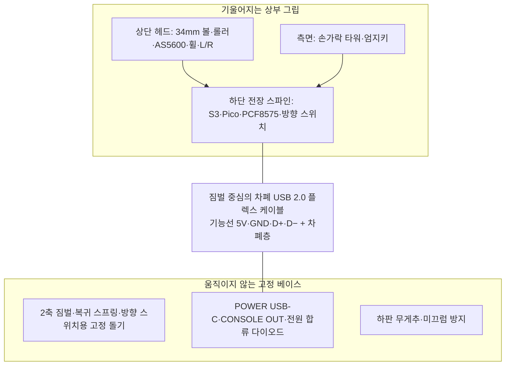

# OneGrip Play 계획 및 부품안

> 작성 기준일: 2026-08-09  
> 개발 완료 목표일: 2026-08-28  
> 예산 상한: 700,000원  
> 대상 플랫폼: Windows PC, Nintendo Switch, PlayStation 4  
> 제작 원칙: 커스텀 PCB와 만능기판 없이 완제품 개발보드·모듈·직결 하네스 사용

## 1. 최종 결론

이번 시제품은 전체 문자를 입력하는 한 손 키보드가 아니라, 한 손을 기기에서 떼지 않고 다음 활동을 수행하는 **멀티플랫폼 여가생활 보조 컨트롤러**로 개발한다.

- PC 환경 게임: League of Legends 중심의 키보드·마우스 조작
- PC 게임패드 게임: USB XInput 조작
- Nintendo Switch 게임
- PlayStation 4 게임
- 간단한 웹 검색과 웹페이지 탐색
- YouTube 및 OTT 검색·재생·일시정지·스크롤·음량 조절

전체 알파벳, Bank A/B 문자층, 한글·숫자층과 추가 알파벳용 엄지 보조키는 제거한다. 검색어 입력은 화면 키보드로 처리한다. 이 결정으로 학습 부담과 오입력 가능성을 줄이고, 8월 28일까지 실제 작동하는 시제품을 완성하는 데 집중한다.

제품 임시 명칭은 `OneGrip Play`로 한다.

## 2. 목표 사용자와 사용 범위

### 2.1 우선 대상

- 한쪽 손만 주로 사용하는 사용자
- 엄지로 트랙볼을 굴릴 수 있는 사용자
- 검지·중지·약지·소지를 각각 조금씩 좌우로 움직이거나 누를 수 있는 사용자
- 손목과 전완 이동이 어렵지만 그립을 작은 범위로 기울일 수 있는 사용자
- 일반 게임패드나 키보드·마우스를 동시에 잡기 어려운 사용자

### 2.2 시제품의 한계

- 심한 경직이나 손가락 분리 동작이 거의 불가능한 사용자에게는 바로 적합하지 않을 수 있다.
- 그립 기울임은 1차 시제품에서 디지털 8방향 왼쪽 스틱으로 구현하므로, 레이싱 게임처럼 미세한 아날로그 이동이 필요한 게임에서는 정밀도가 제한된다.
- 콘솔별 진동, 모션 센서, 이어폰 단자와 PS4 터치패드 제스처는 1차 범위에서 제외한다. 터치패드 **클릭**만 버튼으로 제공한다.
- 모든 콘솔 호환성은 변환기 제조사의 지원 목록과 펌웨어에 영향을 받으므로 실기 시험 전에는 확정적으로 주장하지 않는다.

## 3. 물리 설계

### 3.1 전체 구성

- 검지·중지·약지·소지용 관통형 U자 지지 타워 4개
- 각 손가락의 지문이 닿는 위치에 3방향 로커 휠 1개
- 손가락별 `엄지 방향으로 밀기 / 중앙 누르기 / 바깥 방향으로 밀기`
- 총 12개 손가락 입력
- 엄지 자연 도달 위치의 약 34mm 트랙볼
- 트랙볼 바로 오른쪽의 물리 스크롤 휠
- 트랙볼 바로 아래의 독립 좌클릭·우클릭 패들
- 엄지 기본키 6개: Space, Backspace, Shift, Enter, Ctrl, Alt
- 본체 전체가 전후좌우로 기울고 중앙으로 돌아오는 복귀형 그립
- 손 중앙을 지지하되 엄지 이동을 가리지 않는 중수골 스트랩
- 본체 후면 하단의 3단 모드 슬라이드 스위치

### 3.2 권장 외형 범위

| 항목 | 1차 권장값 |
|---|---:|
| 전체 높이 | 120~130mm |
| 전체 폭 | 85~95mm |
| 전체 깊이 | 100~115mm |
| 손바닥이 잡는 그립 두께 | 45~55mm |
| 트랙볼 지름 | 약 34mm |
| 트랙볼 검출부 | 직교 롤러 2개 + AS5600 자기 엔코더 2개 |
| 손가락 타워 수직 중심 간격 | 20~24mm |
| 타워별 전후 조절 | ±8mm |
| 타워별 각도 조절 | ±8° |
| 그립 최대 기울기 | 전후좌우 약 ±7~8° |
| 방향 입력 시작각 | 중앙에서 약 3~4° |
| 중수골 스트랩 폭 | 20~25mm |

중지 타워를 가장 앞에 두고, 검지·약지 타워를 그보다 약간 뒤로, 소지 타워를 가장 뒤로 배치한다. 네 타워의 길이와 위치를 동일하게 만들지 않는다. 타워는 나사 슬롯으로 조절하고, 사용자의 손 크기가 확정되면 최종 위치를 고정한다.

### 3.3 3방향 손가락 스위치

각 로커 캡 아래에 KW-10 마이크로스위치 3개를 배치한다.

1. 캡을 엄지 방향으로 밀면 측면 스위치 1개 작동
2. 캡 중앙을 아래로 누르면 중앙 스위치 작동
3. 캡을 바깥 방향으로 밀면 반대 측면 스위치 작동
4. 손가락 힘을 빼면 토션 스프링 또는 판스프링으로 중앙 복귀

초기 시험 목표값은 다음과 같다.

| 항목 | 시험 범위 |
|---|---:|
| 좌우 캡 이동량 | 각 1.5~2.0mm |
| 중앙 누름 이동량 | 0.8~1.2mm |
| 목표 손끝 작동력 | 약 0.7~1.2N |
| 입력 디바운스 | 8~15ms |
| 중앙 복귀 확인시간 | 30~50ms |

한 손가락 로커 모듈 하나를 먼저 출력하고, 세 방향이 분명하게 구분된 뒤 나머지 세 모듈을 복제한다.

### 3.4 완제품 분해 없는 34mm 트랙볼

완제품 트랙볼 마우스를 분해하지 않고, 외형은 기존 렌더의 엄지용 34mm 트랙볼 형태를 유지한다. Adafruit 5063 같은 패널형 모듈은 면적과 버튼 배치가 커서 버티컬 그립 외형을 바꾸므로 사용하지 않는다.

트랙볼 내부는 전통적인 기계식 2축 롤러 구조로 제작한다.

1. 34mm 교체용 트랙볼 아래에 지름 6~8mm 롤러 2개를 서로 직각으로 배치한다.
2. 롤러 표면에는 얇은 실리콘 튜브 또는 O링을 씌워 볼과의 미끄럼을 줄인다.
3. 각 롤러 축 끝에 직경 방향 자석을 고정하고 AS5600 12비트 자기 엔코더 모듈을 마주 보게 설치한다.
4. 세 번째 스프링 아이들러가 볼을 두 롤러 쪽으로 약하게 밀어 접촉을 유지한다.
5. 상단 리테이너 링은 볼의 이탈만 막고 엄지의 이동 범위를 가리지 않는다.
6. AS5600 두 개의 아날로그 OUT을 ESP32-S3 ADC 두 채널로 각각 읽는다. 같은 I2C 주소 문제를 피하기 위해 1차 시제품에서는 I2C를 사용하지 않는다.
7. 펌웨어는 0/4095 경계를 통과하는 각도값을 연속 회전량으로 풀고 X/Y 이동량으로 변환한다.

이 구조는 커스텀 PCB가 필요 없고, 볼·롤러·엔코더를 나사로 교체할 수 있다. 대신 롤러 미끄럼과 축 정렬이 핵심 위험이므로 전체 본체 CAD보다 먼저 트랙볼 단독 지그를 제작한다.

**트랙볼 Gate:** 볼을 좌우·상하로 각각 100회 왕복했을 때 축 누락과 역방향 튐이 없어야 한다. 200mm 커서 왕복을 20회 반복해 끝점 편차가 화면 폭의 10%를 넘으면 롤러 압력·O링 재질·가속 설정을 수정한다.

### 3.5 그립 기울임

- 본체 하단에 서로 직교하는 2축 회전축을 배치한다.
- 전후좌우 KW-10 스위치 4개는 가동부의 안쪽 짐벌 링에 고정하고, 고정 베이스의 조절식 돌기가 스위치를 누르게 한다.
- 대각선은 인접한 스위치 2개가 동시에 눌리는 방식으로 인식한다.
- 각 축에 토션 스프링 또는 인장 스프링을 배치해 중앙으로 복귀시킨다.
- 축과 본체 사이에는 기계식 스토퍼를 넣어 스위치가 구조 하중을 직접 받지 않게 한다.
- 안쪽·바깥쪽 짐벌 링의 회전 중심을 일치시키고 중앙에 지름 10~12mm의 빈 배선 통로를 둔다.
- 내부 배선은 네 개의 점퍼선이 아니라 차폐층과 꼬임 D+/D− 쌍을 유지한 유연한 USB 2.0 연선 케이블 한 가닥을 사용한다.
- 케이블은 축을 감지 않는 물방울형 또는 Ω형 여유 루프로 중앙 통로를 통과시키며, 전후좌우 어느 방향에서도 팽팽해지지 않게 한다.
- 회전축 양쪽 10mm 밖에서 케이블을 고정해 납땜부와 커넥터가 반복 굽힘을 받지 않게 한다.

1차 시제품에서는 그립 기울임을 디지털 입력으로 구현한다. 아날로그 홀 센서식 기울기는 공모전 이후 2차 개선안으로 남긴다.

## 4. 3단 모드 스위치

누를 때마다 상태가 순환하는 버튼 대신, 위치가 눈과 촉각으로 확인되는 3단 슬라이드 스위치를 사용한다.

| 위치 | 모드 | 출력 |
|---:|---|---|
| 1 | PC GAME | BLE 키보드 + 마우스 |
| 2 | CONSOLE | USB 게임패드 |
| 3 | MEDIA | BLE 마우스 + 키보드 + 미디어 제어 |

- 스위치는 오입력 방지를 위해 본체 후면 하단에 둔다.
- 모드별로 파랑·주황·초록 LED를 표시한다.
- 모드를 바꿀 때 먼저 모든 키·스틱 값을 해제하고 100ms 뒤 새 모드를 적용한다.
- 전원을 껐다 켜도 물리 스위치 위치가 곧 현재 모드이므로 별도 상태 기억이 필요 없다.

## 5. 모드별 키 배치

좌우 표현은 왼손·오른손 버전에서 뒤집히므로 `엄지 방향 / 중앙 / 바깥 방향`으로 통일한다.

### 5.1 PC GAME: League of Legends 기본 배치

| 손가락 | 엄지 방향으로 밀기 | 중앙 누르기 | 바깥 방향으로 밀기 |
|---|---:|---:|---:|
| 검지 | D | R | F |
| 중지 | 3 | E | 4 |
| 약지 | 1 | W | 2 |
| 소지 | Tab | Q | B |

| 조작부 | 기능 |
|---|---|
| 트랙볼 | 마우스 포인터 |
| L/R 패들 | 좌·우 클릭 |
| 휠 | 확대·축소 또는 스크롤 |
| 그립 전후좌우 | 화면 카메라 방향키 |
| Space | 챔피언 화면 중앙 정렬 |
| Enter | 채팅 |
| Ctrl + Q/W/E/R | 스킬 레벨 상승 |
| Shift·Alt | 게임 보조키 |
| Backspace | 기본 Backspace, 게임별 재지정 가능 |

일반 PC 게임패드 게임은 CONSOLE 모드에서 USB XInput으로 실행한다.

### 5.2 CONSOLE: Switch·PS4 공통 위치 배치

Nintendo와 PlayStation은 A/B/X/Y와 도형의 위치가 다르므로, 물리 키에는 위치 기반 이중 라벨을 붙인다.

| 물리 위치 | PS4 | Switch |
|---|---|---|
| 아래 | × | B |
| 오른쪽 | ○ | A |
| 왼쪽 | □ | Y |
| 위 | △ | X |

| 손가락 | 엄지 방향으로 밀기 | 중앙 누르기 | 바깥 방향으로 밀기 |
|---|---|---|---|
| 검지 | R1 / R | × / B | R2 / ZR |
| 중지 | L1 / L | ○ / A | L2 / ZL |
| 약지 | D-pad Up | □ / Y | D-pad Down |
| 소지 | D-pad Left | △ / X | D-pad Right |

| 조작부 | CONSOLE 기능 |
|---|---|
| 그립 전후좌우 | 왼쪽 스틱 8방향 |
| 트랙볼 | 오른쪽 스틱 속도 입력 |
| L 클릭 패들 | L3 |
| R 클릭 패들 | R3 |
| 휠 반시계·시계 | 이전·다음 무기 또는 L1·R1 중복 |
| Space | PS4 Options / Switch + |
| Backspace | PS4 Share / Switch - |
| Shift | PS / Home |
| Enter | PS4 Touchpad Click / Switch Capture |
| Ctrl·Alt | 콘솔에서는 미사용, PC·MEDIA 전용 |

### 5.3 MEDIA: 웹·YouTube·OTT

| 손가락 | 엄지 방향으로 밀기 | 중앙 누르기 | 바깥 방향으로 밀기 |
|---|---|---|---|
| 검지 | 브라우저 뒤로 | 선택·Enter | 브라우저 앞으로 |
| 중지 | 되감기 | 재생·일시정지 | 빨리감기 |
| 약지 | 음량 감소 | 음소거 | 음량 증가 |
| 소지 | 이전 탭 | 전체화면 | 다음 탭 |

| 조작부 | MEDIA 기능 |
|---|---|
| 트랙볼 | 마우스 포인터 |
| L/R 패들 | 좌·우 클릭 |
| 휠 | 웹페이지·목록 스크롤 |
| 휠 누르기 | 가운데 클릭 |
| 그립 전후좌우 | 방향키 |
| Space | 재생·일시정지 |
| Backspace | 뒤로 가기 |
| Enter 짧게 | 선택 |
| Enter 1.5초 | Windows 화면 키보드 실행 |

PC 검색어는 화면 키보드를 트랙볼과 좌클릭으로 입력한다. Switch·PS4에서는 검색창을 선택하면 나타나는 콘솔 화면 키보드를 게임패드로 조작한다.

## 6. 전자 구조

### 6.1 전체 신호 흐름



#### 6.1.1 고정부와 가동부의 부품 배치

전자부품을 고정 베이스에 두고 스위치 선 수십 가닥을 짐벌 축으로 통과시키지 않는다. 입력부와 MCU를 모두 기울어지는 상부 그립에 넣고, 고정 베이스와 상부 사이에는 차폐된 USB 2.0 내부 케이블 한 가닥만 통과시킨다. 기능 도체는 5V·GND·D+·D− 네 개지만 차폐층을 포함한 완성 케이블을 사용한다.



상부 내부는 세 구역으로 나눈다.

| 구역 | 배치 부품 | 설계 이유 |
|---|---|---|
| 상단 헤드 | 34mm 볼컵, 직교 롤러 2개, AS5600 2개, 스크롤 휠, L/R 패들 | 엄지와 센서 사이 기구 길이를 최소화 |
| 손가락·엄지 외피 안쪽 | 로커 스위치, 엄지키, 짧은 JST 하네스 | 스위치 선이 회전축을 지나지 않음 |
| 회전축 바로 위 하단 45~55mm | ESP32-S3, Pico, PCF8575, RC 필터, 방향 스위치 4개 | 무거운 부품과 배선을 회전 중심 가까이에 둬 기울임 토크 감소 |

S3와 Pico를 트랙볼 바로 아래에 쌓지 않는다. 두 보드는 세로 전장 스파인 양면에 각각 M2 나사로 고정하고 보드 사이에 최소 4mm 간격을 둔다. PCF8575는 손가락 타워 쪽 벽에 세로로 고정한다. 모듈은 하단 정비 덮개를 열면 개별 교체할 수 있어야 한다.

고정 베이스에는 MCU와 방향 스위치를 넣지 않는다. 베이스의 역할은 짐벌, 복귀 스프링, 방향 스위치를 누르는 조절식 돌기, USB 패널 단자, 전원 합류용 쇼트키 다이오드, 무게추로 제한한다.

### 6.2 ESP32-S3 역할

- AS5600 두 채널의 롤러 각도를 읽어 트랙볼 X/Y 상대 이동량으로 변환
- PCF8575 모듈을 통해 손가락 12개와 그립 4방향 입력 수집
- 엄지 기본키, L/R 클릭, EC11 휠과 모드 스위치 입력 수집
- PC GAME과 MEDIA에서 하나의 BLE 복합 HID 장치 `OneGrip Play` 출력
- CONSOLE에서 트랙볼 이동량을 오른쪽 스틱 속도값으로 변환
- 휠 방향을 콘솔용 두 개의 펄스로 변환해 RP2040에 전달

Espressif의 BLE HID 예제는 한 장치에서 Mouse, Keyboard, Consumer Control 보고서를 함께 제공한다.

- [Espressif BLE HID Device 공식 예제](https://github.com/espressif/esp-idf/tree/master/examples/bluetooth/bluedroid/ble/ble_hid_device_demo)

콘솔 출력은 GP2040-CE 호환성과 일정 안정성을 위해 별도 RP2040이 담당한다. ESP32-S3는 BLE 복합 HID와 입력 통합에만 집중한다.

### 6.3 RP2040 역할

- GP2040-CE를 사용해 USB XInput 게임패드로 출력
- 손가락 12개, 그립 4방향, L/R 패들, 콘솔용 엄지키 4개를 직접 읽음
- ESP32-S3에서 전달받은 휠 좌우 펄스 2개를 읽음
- ESP32-S3의 트랙볼 X/Y PWM을 RC 필터 후 ADC로 읽어 오른쪽 스틱으로 출력

RP2040 핀 배분은 다음과 같이 고정한다.

| 입력 | 핀 수 |
|---|---:|
| 손가락 로커 12개 | 12 |
| 그립 전후좌우 | 4 |
| 트랙볼 아래 L/R | 2 |
| 콘솔용 엄지키 4개 | 4 |
| 휠 방향 펄스 | 2 |
| 트랙볼 X/Y 아날로그 | ADC 2 |
| 합계 | 디지털 24 + ADC 2 |

GP2040-CE는 XInput, Switch, PS4 등의 모드와 아날로그 스틱 입력을 지원한다.

- [GP2040-CE 입력 모드](https://gp2040-ce.info/usage/)
- [GP2040-CE 아날로그 스틱 설정](https://gp2040-ce.info/add-ons/analog/)

### 6.4 트랙볼을 오른쪽 스틱으로 변환

트랙볼은 상대 이동량을 내보내고 게임패드 스틱은 중심 기준 기울기를 요구하므로 다음 변환을 사용한다.

1. ESP32-S3가 8ms 간격으로 트랙볼 ΔX·ΔY를 읽는다.
2. 작은 움직임은 낮은 스틱 값, 빠른 움직임은 높은 스틱 값으로 변환한다.
3. X/Y 값을 20kHz PWM 두 채널로 출력한다.
4. 각 채널을 `10kΩ + 100nF` RC 필터에 통과시킨다.
5. RP2040 ADC GPIO26·GPIO27에서 약 0~3.3V로 읽는다.
6. 트랙볼이 30~50ms 정지하면 1.65V 중앙값으로 복귀한다.

PWM 변환이 일정 내 안정화되지 않으면 1차 시제품에서는 트랙볼을 오른쪽 스틱의 디지털 8방향으로 단순화한다. GP2040-CE의 Dual Directional Input을 대체 경로로 사용할 수 있다.

### 6.5 PCB 없는 배선

- 커스텀 PCB 발주 없음
- 만능기판 없음
- 브레드보드는 시험 단계에서만 사용하고 최종 본체에는 넣지 않음
- ESP32-S3, Raspberry Pi Pico, PCF8575, AS5600 완제품 모듈만 사용
- 모든 스위치는 JST 하네스와 열수축튜브로 직결
- 손가락 12개와 그립 4개 신호는 상부 그립 내부에서만 Y 하네스로 PCF8575와 RP2040에 분기
- 두 MCU는 같은 3.3V 기준과 GND 사용
- 각 MCU 신호 분기에 1kΩ 직렬 저항 사용
- AS5600 두 개는 3.3V로 구동하고 각 아날로그 OUT을 ESP32-S3 ADC에 직접 연결
- 두 MCU와 PCF8575는 회전축 바로 위의 3D 프린팅 세로 전장 트레이에 나사 고정
- 짐벌을 통과하는 배선은 유연한 차폐 USB 2.0 케이블 한 가닥뿐이며 개별 점퍼선은 사용하지 않음
- D+와 D−의 꼬임과 차폐층은 가동 구간에서 자르거나 풀지 않음
- 커넥터나 납땜 접속부는 가동 구간 밖에 두고, 케이블 양끝에 스트레인 릴리프 적용
- 물방울형 또는 Ω형 서비스 루프를 두고 동적 굽힘 반지름은 구매 케이블 사양을 따르되 1차 목표를 15mm 이상으로 설정
- 커넥터마다 `F1-L`, `F1-C`, `F1-R`처럼 라벨 부착

## 7. 연결 방식

### 7.1 PC GAME·MEDIA

- 외부 `POWER` USB-C 포트로 5V 전원만 공급
- POWER 포트는 고정 베이스에서 쇼트키 다이오드를 거쳐 상부의 S3와 Pico에 전원 공급
- PC와는 Bluetooth 장치 `OneGrip Play` 하나만 페어링
- 별도 마우스와 무선 수신기가 없으며 내부 트랙볼 신호도 `OneGrip Play`로 통합
- PC에서 키보드·마우스·미디어 리모컨이 하나의 BLE 장치로 표시됨

### 7.2 PC 게임패드 게임

- RP2040의 `CONSOLE OUT` USB를 PC에 직접 연결
- CONSOLE OUT의 USB D+/D−는 짐벌 중앙의 짧은 USB 플렉스 하네스를 거쳐 상부 Pico에 연결
- 모드 스위치를 CONSOLE로 설정
- PC에서 XInput 게임패드로 인식

### 7.3 Switch·PS4

```text
OneGrip Play CONSOLE OUT
          ↓ USB XInput
Brook Wingman XE2
          ↓
Nintendo Switch 또는 PS4
```

Wingman XE2는 제조사 기준으로 PS4·PS3·Nintendo Switch·Switch 2·PC를 지원한다.

- [Brook Wingman XE2 공식 제품 페이지](https://www.brookaccessory.com/products/wingmanxe2/index_ko.html)
- [국내 배송 판매 예시 1](https://www.coupang.com/vp/products/8666251277)
- [국내 배송 판매 예시 2](https://www.coupang.com/vp/products/7557395821)

단, GP2040-CE XInput 장치가 XE2의 공식 호환 목록에 명시된 것은 아니므로 8월 14일까지 실제 두 콘솔에서 확인한다. PS4는 8분 인증 제한을 확인하기 위해 최소 30분 연속 시험한다. Switch는 시스템 설정에서 `Pro 컨트롤러 유선 통신`을 켠다.

## 8. 국내 조달 BOM

가격은 2026-08-09 검색 기준의 안전 예산이다. 실제 결제 전 재고·국내 출고 여부·도착 예정일·VAT·배송비를 다시 확인한다. 해외 1~2주 표기 상품은 같은 규격의 국내 재고품으로 대체한다.

| 분류 | 부품 | 수량 | 단가 예산 | 소계 | 국내 구매 링크·비고 |
|---|---|---:|---:|---:|---|
| 트랙볼 기구 | 34mm 교체용 볼 + AS5600 자석 엔코더 모듈 2개 | 1식 | 60,000원 | 60,000원 | [34mm 볼 국내 판매 예시](https://www.coupang.com/vp/products/8948428331), [AS5600 국내 판매](https://www.jenomall.com/goods/goods_view.php?goodsNo=1000034136), [자석 포함 모듈](https://www.mechasolution.com/goods/goods_view.php?goodsNo=605131) |
| 주 MCU | LOLIN S3 V1.0.0 ESP32-S3 | 2 | 17,600원 | 35,200원 | [디바이스마트](https://www.devicemart.co.kr/goods/view?no=15164113), 1개 예비 |
| USB 게임패드 MCU | Raspberry Pi Pico RP2040 | 2 | 6,600원 | 13,200원 | [아이씨팩토리](https://icfactory.co.kr/product/%EB%9D%BC%EC%A6%88%EB%B2%A0%EB%A6%AC%ED%8C%8C%EC%9D%B4-%ED%94%BC%EC%BD%94-raspberrypi-pico/1242/), 1개 예비 |
| I/O 확장 | PCF8575 16채널 I2C 모듈 | 2 | 7,260원 | 14,520원 | [다나와 국내 빠른배송 예시](https://prod.danawa.com/info/?pcode=99305156), 1개 예비 |
| 로커·그립·클릭 | KW-10 마이크로스위치 | 20 | 517원 | 10,340원 | [디바이스마트](https://www.devicemart.co.kr/goods/view?no=13764), 사용 18개+예비 2개 |
| 엄지 기본키 | 12×12 LED 택트스위치 | 8 | 990원 | 7,920원 | [디바이스마트](https://www.devicemart.co.kr/goods/view?no=1312318), 사용 6개+예비 2개 |
| 스크롤 | EC11 로터리 엔코더 모듈 | 2 | 3,700원 | 7,400원 | [디바이스마트 EC11 카테고리](https://www.devicemart.co.kr/goods/catalog?code=000400080003), 1개 예비 |
| 모드 선택 | 소형 3단 ON-ON-ON 슬라이드 스위치 | 2 | 3,000원 | 6,000원 | [디바이스마트 슬라이드 스위치 검색](https://www.devicemart.co.kr/goods/catalog?code=000200010005), 1개 예비 |
| USB 연결 | USB-C 전원 모듈과 USB 출력 케이블 | 1묶음 | 15,000원 | 15,000원 | [디바이스마트 USB 관련](https://www.devicemart.co.kr/goods/catalog?code=000400030012&page=1) |
| 신호 조정 | 1kΩ·10kΩ 저항, 100nF 커패시터, LED, 1N4148 | 1묶음 | 15,000원 | 15,000원 | [디바이스마트 1N4148](https://www.devicemart.co.kr/goods/view?no=25) |
| 하네스 | JST-XH, 26~28AWG 전선, 압착단자, 열수축튜브 | 1묶음 | 35,000원 | 35,000원 | [디바이스마트 하네스·케이블](https://www.devicemart.co.kr/goods/catalog?code=001100130003&display_style=newlist) |
| 기구부 | 축, 부싱·베어링, 토션·인장 스프링, M2~M5 나사 | 1묶음 | 45,000원 | 45,000원 | 국내 철물·로봇 부품몰 묶음 구매 |
| 손 지지 | 20~25mm 벨크로 스트랩, 네오프렌, EVA·실리콘 패드 | 1묶음 | 25,000원 | 25,000원 | 국내 재활·스포츠·원단몰 구매 |
| 1차 출력 | PLA 또는 PETG 기능 시제품 | 1회 | 70,000원 | 70,000원 | [와이하우스](https://yhouse.co.kr/ko/service) 또는 [프린트3D](https://www.print3d.co.kr/) 견적 |
| 최종 출력 | PETG 본체·TPU 접촉부 | 1회 | 120,000원 | 120,000원 | 견적 비교 후 1~3일 출력 업체 우선 |
| 콘솔 변환 | Brook Wingman XE2 | 1 | 최대 105,000원 | 105,000원 | [쿠팡 예시 1](https://www.coupang.com/vp/products/8666251277), [쿠팡 예시 2](https://www.coupang.com/vp/products/7557395821) |
| 마감 | 미끄럼 패드, 라벨, 접착제, 윤활제 | 1묶음 | 20,000원 | 20,000원 | 국내 문구·철물몰 |
| 배송 | 전자부품·기구부 긴급 배송비 | 1식 | 35,000원 | 35,000원 | 일정 보호용 |
| 예비비 | 트랙볼 롤러 재출력·최종 재출력·대체 부품 | 1식 | 55,000원 | 55,000원 | 승인 후에만 사용 |
|  | **최악 조건 총계** |  |  | **694,580원** | **상한 대비 5,420원 잔여** |

Wingman XE2를 87,010원에 구매하면 예상 총액은 676,590원이고 잔여액은 23,410원이다. 105,000원보다 비싸면 구매하지 말고 다른 국내 판매처 또는 중고 정품을 검토한다.

### 8.1 구매 우선순위

#### 오늘 바로 주문할 P0 부품

1. 34mm 교체용 볼 1개와 AS5600 자석 엔코더 모듈 2개
2. LOLIN S3 2개
3. Raspberry Pi Pico 2개
4. PCF8575 모듈 2개
5. KW-10 20개
6. EC11 2개
7. 엄지 택트스위치 8개
8. 3단 모드 스위치 2개
9. Wingman XE2 1개
10. 트랙볼용 3mm 축·소형 베어링·O링·스프링
11. JST·전선·저항·커패시터·USB 모듈

#### 시험 뒤 주문할 P1 부품

1. 그립 축과 스프링 최종 규격
2. 중수골 스트랩 재료
3. 최종 PETG·TPU 출력
4. 라벨과 마감재

예비비는 트랙볼 롤러 재제작, Wingman XE2 교체, 최종 출력 재작업 중 하나가 실제로 발생할 때만 사용한다.

## 9. 개발 일정

### 8월 9일: 사양 동결·주문

- PC·Switch·PS4만 지원
- PC GAME / CONSOLE / MEDIA 세 모드로 고정
- 전체 알파벳과 추가 모드 금지
- P0 부품 전량 주문
- GitHub 폴더 구조 생성

### 8월 10~11일: 핵심 전자 기능

- AS5600 1축 롤러 지그에서 연속 회전각 읽기
- 두 AS5600의 X/Y 이동량을 BLE 마우스로 출력
- BLE Keyboard·Mouse·Consumer Control을 `OneGrip Play` 하나로 통합
- Raspberry Pi Pico에 GP2040-CE 설치
- PC에서 XInput 게임패드 인식 확인

**Gate 1:** 8월 11일 종료 시 PC에는 BLE 장치 하나만 나타나고 임시 롤러 X/Y, 좌우 클릭, 스크롤, 키 1개가 함께 작동해야 한다.

### 8월 12~14일: 콘솔 실기 검증

- 임시 버튼으로 XInput 기본 버튼·방향 입력 구성
- Wingman XE2 최신 정식 펌웨어 적용
- Switch 연결과 Pro 컨트롤러 유선 통신 확인
- PS4에서 30분 이상 연속 입력 시험
- PS4 ×/○/□/△, Options, Share, PS, Touchpad Click 확인
- Switch A/B/X/Y, +/-, Home, Capture 확인

**Gate 2:** 8월 14일까지 Switch와 PS4에서 각각 한 게임을 30분 이상 조작해야 한다. 실패하면 전체 기구를 출력하기 전에 입력 모드 또는 변환 경로를 수정한다.

### 8월 15~17일: 손가락 모듈·그립 지그

- 로커 휠 1개와 U자 지지대 1개 출력
- 34mm 볼컵·직교 롤러·스프링 아이들러 지그 출력
- 트랙볼 좌우·상하 100회 왕복과 미끄럼 시험
- 좌·중앙·우 100회씩 입력 시험
- 손가락이 중립 상태에서 아무 스위치도 누르지 않는지 확인
- 그립 2축 지그 출력
- 전후좌우 및 대각선 입력과 중앙 복귀 확인
- 스트랩 폭과 엄지의 Alt 도달 범위 확인

### 8월 18일: 설계 동결

- 손가락 길이에 따른 타워 전후 위치 확정
- 트랙볼·휠·L/R 패들 위치 확정
- 모드 스위치와 두 USB 포트 위치 확정
- 상부 하단 전장 스파인과 짐벌 중앙 차폐 USB 케이블 통로 확정
- 새로운 기능 추가 금지

### 8월 19~21일: 최종 CAD·출력

- PETG 구조부와 TPU 접촉부 출력
- 출력 중 펌웨어 디바운스·모드 매핑 완성
- 예비 S3와 Pico에 동일 펌웨어 저장

### 8월 22~24일: 배선·조립

- JST 하네스 제작
- 모듈 전장 트레이 고정
- 상부 내부 Y 분기와 공통 GND 배선
- 34mm 볼컵, AS5600 2개, S3, Pico, PCF8575 조립
- 차폐 USB 플렉스 케이블에 스트레인 릴리프와 물방울형 또는 Ω형 축 루프 적용

### 8월 25~26일: 통합 시험

- PC GAME LoL 연습 모드 30분
- PC MEDIA에서 웹 검색·YouTube·OTT 작업 수행
- Switch 30분 게임
- PS4 30분 게임
- 2시간 연속 전원·입력 시험
- 모드 전환 시 키 고착 여부 시험

### 8월 27일: 발표·백업

- 1분 시연 순서 작성
- PC GAME → MEDIA → Switch 또는 PS4 순서로 촬영
- 예비 MCU, 케이블, 드라이버, 펌웨어 파일 준비
- BOM 영수증과 멘토 피드백 기록 정리

### 8월 28일: 완료

- 새 기능 추가 금지
- 외관 보수와 케이블 정리만 허용
- 작동 영상, 설계 파일, BOM, 테스트 기록 제출

## 10. 검증 기준

### 10.1 입력 정확도

- 손가락 로커 12방향을 각 100회 작동했을 때 95회 이상 정확히 입력
- 중앙 누름 중 좌우 스위치 동시 입력률 3% 이하
- 그립 4방향을 각 100회 작동했을 때 98회 이상 정확히 복귀
- 모드 전환 30회 중 키 고착 0회

### 10.2 플랫폼

- Windows Bluetooth 목록에 `OneGrip Play` 하나만 표시
- PC GAME에서 트랙볼과 Q/W/E/R, D/F, 1~4 입력 가능
- MEDIA에서 링크 선택, 스크롤, 재생·일시정지, 음량, 전체화면 가능
- Switch에서 30분 이상 연결 유지
- PS4에서 30분 이상 연결을 유지해 8분 인증 끊김이 없음을 확인

### 10.3 인체공학

- 5분 설명 후 사용자가 세 방향 스위치와 모드 스위치를 구분
- 20분 사용 중 손가락이 타워 밖으로 반복 이탈하지 않음
- 중수골 스트랩이 엄지의 Space~Alt 도달 경로를 막지 않음
- 손을 놓으면 그립이 중앙으로 돌아옴
- 사용 중 하판이 책상에서 밀리거나 들리지 않음

## 11. 주요 위험과 대안

| 위험 | 확인 시점 | 대안 |
|---|---|---|
| GP2040 XInput이 Wingman XE2에서 인식되지 않음 | 8월 14일 이전 | GP2040 Switch 직접 연결을 우선 확보하고, PS4는 XE2에서 XInput·PS3/DInput 모드를 순서대로 시험 |
| PS4가 약 8분 뒤 입력 차단 | 8월 14일 이전 | XE2 펌웨어와 연결 모드를 재확인하고, 해결 전에는 PS4 지원을 확정 표기하지 않음 |
| 트랙볼 롤러가 미끄럽거나 대각선 이동이 끊김 | 8월 17일 이전 | O링 재질과 아이들러 압력을 조정하고, 실패 시 직경이 큰 롤러로 교체해 속도보다 안정성을 우선 |
| ESP32-S3의 ADC 입력과 BLE 복합 HID가 동시에 불안정 | 8월 11일 이전 | ADC 표본 주기를 낮추고 ESP-IDF 공식 예제 버전을 고정하며 보고서를 Mouse·Keyboard·Consumer 세 종류로 제한 |
| PWM 오른쪽 스틱이 흔들림 | 8월 17일 이전 | RC 상수를 조정하고 실패 시 디지털 8방향 DDI로 축소 |
| 로커 세 방향이 함께 눌림 | 8월 17일 이전 | 중앙 플런저 길이 축소, 측면 유격 0.3~0.5mm 추가, 펌웨어 우선순위 적용 |
| 손가락 길이가 맞지 않음 | 8월 18일 이전 | 타워별 ±8mm 슬롯과 교체식 S/M/L U자 지지대 사용 |
| 짐벌 반복 동작으로 USB 내부선이 피로하거나 입력이 끊김 | 8월 24일 이전 | 중공축 중심에 차폐 USB 연선의 물방울형 또는 Ω형 루프를 두고 양끝을 고정하며 전후좌우 1,000회 반복 시험 후 교체 |
| 최종 출력 지연 | 8월 18일 | 1차 출력물도 전장 조립이 가능하도록 나사 규격과 내부 트레이를 동일하게 유지 |

## 12. 시연 시나리오

1. PC GAME으로 전환하고 PC에 `OneGrip Play` 하나가 연결된 것을 보여준다.
2. 트랙볼과 좌우 클릭으로 LoL 연습 모드에서 이동·스킬·아이템을 사용한다.
3. 후면 스위치를 MEDIA로 옮긴다.
4. 브라우저에서 트랙볼로 YouTube를 열고 재생·음량·전체화면을 조작한다.
5. CONSOLE로 옮기고 USB를 Wingman XE2에 연결한다.
6. Switch 또는 PS4에서 그립을 기울여 이동하고 트랙볼로 카메라를 조작한다.
7. 검지~소지의 동일한 세 방향 동작이 플랫폼에 따라 게임 기능으로 바뀌는 것을 설명한다.

## 13. 공모전용 핵심 설명

> OneGrip Play는 한 손을 입력기에서 떼지 않고 네 손가락의 12개 입력, 엄지 트랙볼, 전후좌우 그립 기울임을 이용해 PC와 Nintendo Switch, PlayStation 4 게임을 조작하고, 별도의 미디어 모드로 웹 검색과 YouTube·OTT 시청까지 지원하는 멀티플랫폼 여가생활 보조기기이다.

차별점은 단순한 한 손 키보드가 아니라 다음 네 가지의 결합에 있다.

1. 손가락마다 U자 지지대와 3방향 로커를 제공해 손을 크게 옮기지 않는다.
2. 엄지 트랙볼을 PC에서는 마우스, 콘솔에서는 오른쪽 스틱으로 사용한다.
3. 물리 3단 스위치로 게임·콘솔·미디어 상태를 외우지 않고 선택한다.
4. 같은 기기로 게임뿐 아니라 웹과 영상 시청까지 연결해 장애 사용자의 여가생활 접근성을 넓힌다.

## 14. 권장 GitHub 구조

```text
.
├─ 계획및부품안.md
├─ bom/
│  └─ domestic-bom.csv
├─ cad/
│  ├─ finger-rocker/
│  ├─ gimbal/
│  ├─ thumb-area/
│  └─ enclosure/
├─ firmware/
│  ├─ esp32-s3-ble-bridge/
│  └─ rp2040-gp2040-config/
├─ docs/
│  ├─ wiring.md
│  ├─ keymap.md
│  └─ assembly.md
└─ test/
   ├─ input-test.csv
   ├─ platform-test.md
   └─ mentor-feedback.md
```

## 15. 개발 원칙

1. 8월 14일까지 플랫폼 연결을 먼저 증명한 뒤 외형을 완성한다.
2. 손가락 모듈 하나를 검증하기 전 네 개를 출력하지 않는다.
3. 8월 18일 이후에는 기능을 추가하지 않는다.
4. 사용자에게 외워야 하는 문자층이나 숨겨진 모드 조합을 추가하지 않는다.
5. 모든 모듈과 타워는 커넥터와 나사로 교체 가능하게 만든다.
6. 커스텀 PCB와 만능기판을 사용하지 않는다.
7. 가격, 재고와 배송 예정일은 실제 결제 직전에 다시 확인한다.
